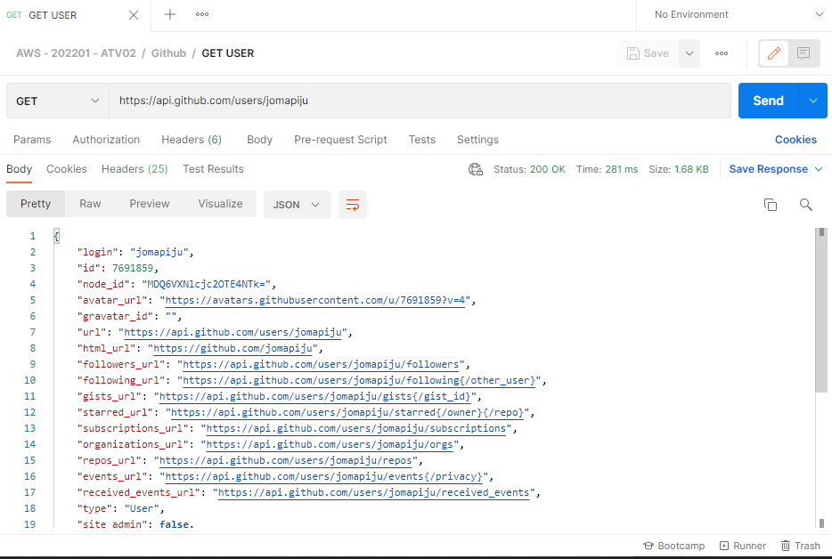
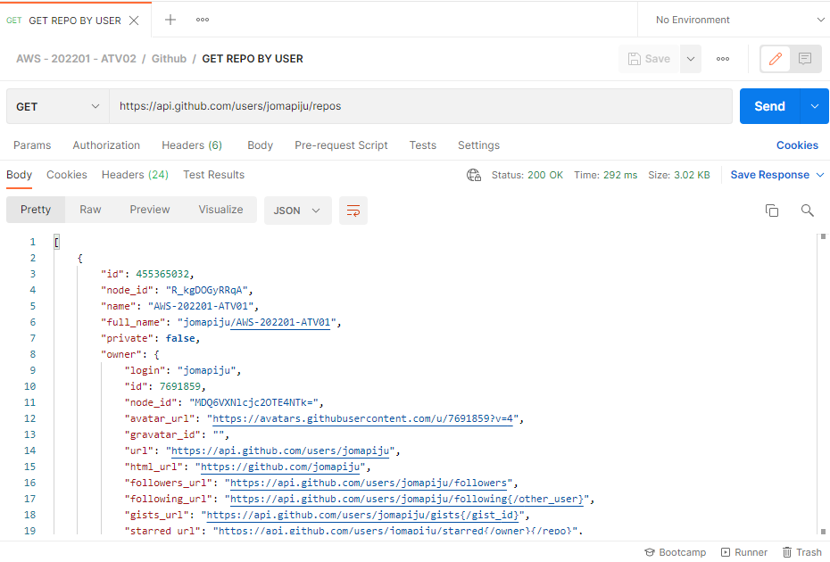
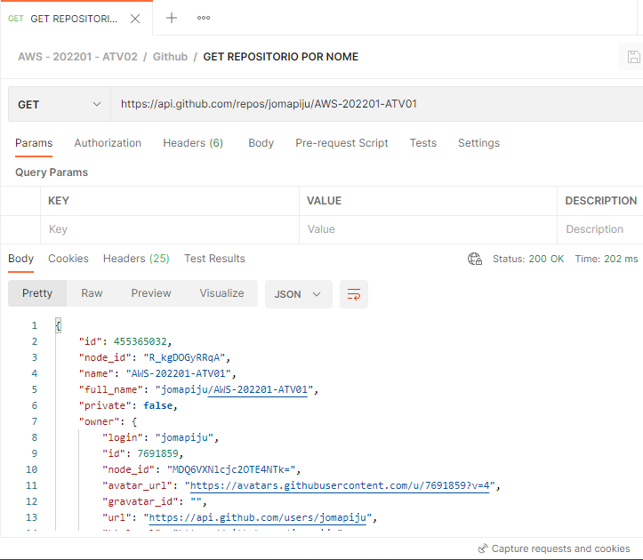
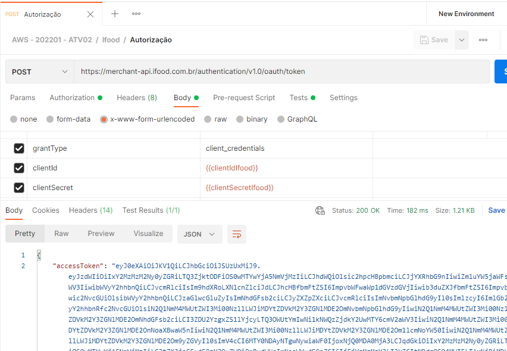
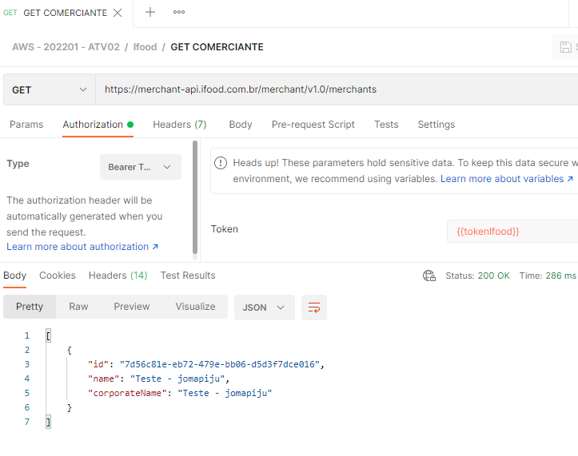
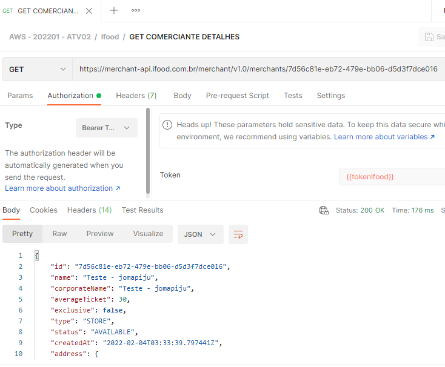
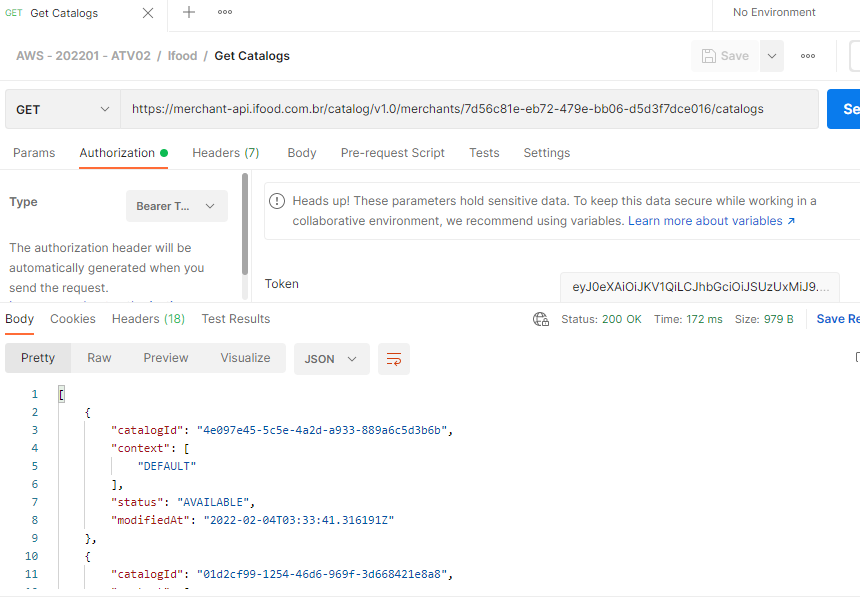
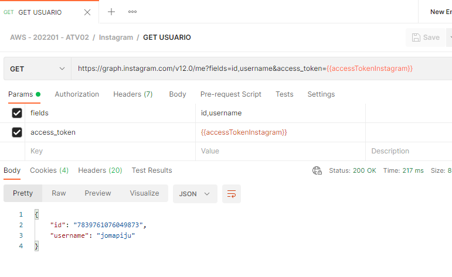
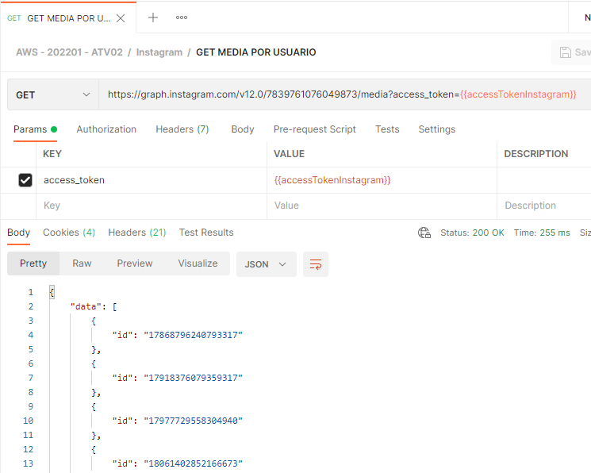
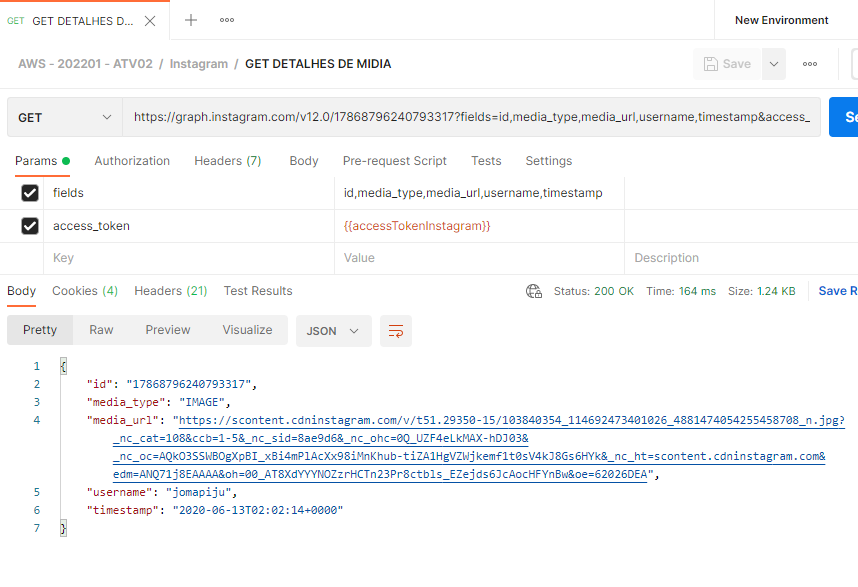

# AWS-202201-ATV02

## Ferramenta:
### Postman

## Provedores
### GITHUB
#### GET USUARIO

#### GET REPOSITORIOS POR USUARIO

#### GET REPOSITORIO POR NOME

### IFOOD
#### AUTORIZACAO

#### GET COMERCIANTE

#### GET COMERCIANTE DETALHES

#### GET CARDAPIO

### INSTAGRAM
#### GET USUARIO

#### GET MEDIA POR USUARIO

#### GET DETALHES DE MIDIA

